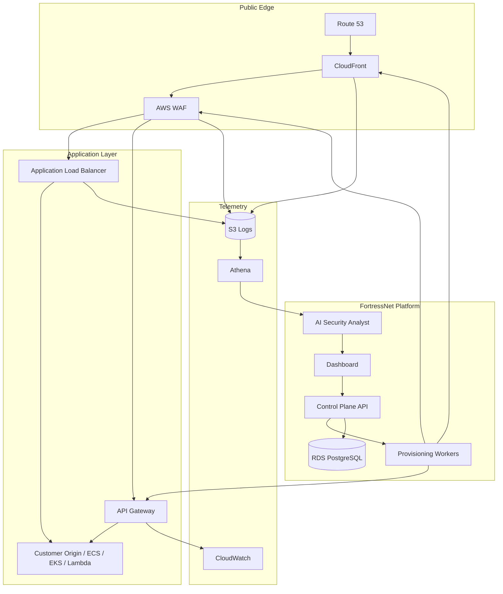

# Arquitectura AWS

FortressNet usa AWS como plataforma de hosting y control, pero mantiene un control plane propio para abstraer, explicar y orquestar las defensas.

## Servicios por capa

| Capa | Servicio AWS |
|---|---|
| DNS | Route 53 |
| CDN / Edge | CloudFront |
| TLS | AWS Certificate Manager |
| WAF | AWS WAF |
| Rate limiting | AWS WAF rate-based rules, API Gateway throttling |
| API protection | API Gateway |
| Routing app | Application Load Balancer |
| Compute | ECS Fargate |
| Base de datos | RDS PostgreSQL |
| Logs historicos | S3 |
| Metricas y logs operativos | CloudWatch |
| Query/reporting | Athena, Glue Data Catalog |
| IA | Amazon Bedrock |
| ZTNA | AWS Verified Access |
| Network security | AWS Network Firewall |
| WAN enterprise | AWS Cloud WAN / Transit Gateway |

## Arquitectura de ejecucion

## Servicios excluidos del MVP inicial

- AWS Shield Advanced.
- AWS WAF Fraud Control.
- OpenSearch permanente.
- Security Lake completo.
- Cloud WAN.
- Network Firewall.
- Cuenta AWS dedicada por tenant.

Estos servicios se consideran para fases enterprise o cuando el cliente justifique el coste.

