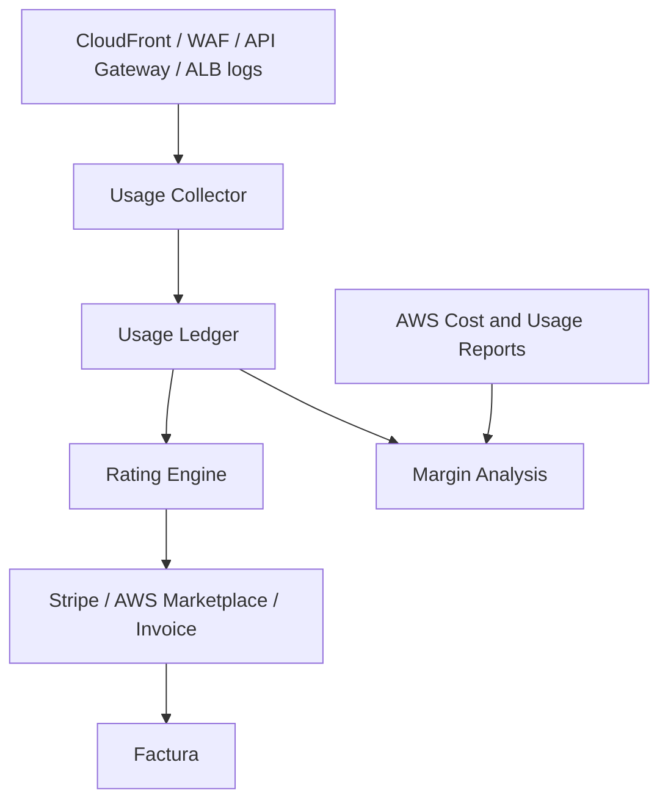

# Billing

FortressNet usa billing SaaS hibrido: plan base mas uso medido.

```text
Factura mensual = plan base + uso medido + add-ons + excesos
```

## Metricas comerciales

Metricas iniciales:

- Requests protegidas.
- Bandwidth transferido.
- Dominios y aplicaciones protegidas.
- Retencion de logs.
- AI Analyst.
- ZTNA apps.
- SASE/network inspection.

Evitar demasiadas metricas en el MVP. La metrica principal debe ser facil de entender: requests protegidas.

## Pipeline de billing



## Componentes

### Usage Collector

Agrega eventos por hora y tenant:

- `protected_requests`
- `blocked_requests`
- `waf_matches`
- `challenge_attempts`
- `bandwidth_gb`
- `log_storage_gb`
- `ai_analysis_runs`

### Usage Ledger

Registro inmutable de uso normalizado:

```json
{
  "tenant_id": "tenant_acme",
  "period": "2026-07",
  "metric": "protected_requests",
  "quantity": 18402391
}
```

### Rating Engine

Convierte uso en coste:

```text
first 10M requests included
next requests at $x per million
bandwidth at $x per GB
extra log retention at $x per GB-month
```

### Billing Provider

Opciones:

- Stripe Billing para SaaS directo.
- AWS Marketplace SaaS Metering para ventas enterprise via AWS.
- Facturacion manual al inicio para clientes grandes.

## AWS Marketplace SaaS

La integracion esta preparada para SaaS Metering, pero no envia uso hasta que exista una oferta publicada y se configure su `product code`. El codigo se conserva solo en el secreto cifrado `platform-config` de AWS Secrets Manager; no se incluye en Terraform versionado, imagenes ni variables de navegador.

Flujo de activacion:

1. Crear la ficha SaaS y las dimensiones `protected_domains` y `protected_requests` en AWS Marketplace Management Portal.
2. Configurar el flujo de fulfillment y resolver el cliente de Marketplace antes de asociarlo al tenant autorizado.
3. Cargar el product code en `marketplace_product_code` dentro del secreto `fortressnet-dev/platform-config` mediante un cambio controlado.
4. Verificar en Console > Billing que Marketplace figura como listo.
5. Asociar el `marketplace_customer_identifier` al entitlement del tenant durante fulfillment; sin esa asociacion, la API rechaza el envio de uso.
6. Ejecutar la medicion desde un operador de plataforma con `billing:write`. Se registra una fila de auditoria y la respuesta resumida de `BatchMeterUsage`.

La consola no permite enviar medicion desde un tenant ni fabrica consumo. Las metricas se calculan a partir de dominios protegidos y eventos WAF observados.

## Control de coste interno

Usar:

- AWS Cost and Usage Reports.
- Cost allocation tags.
- Athena para analizar costes.
- Tags obligatorios: `tenant_id`, `app_id`, `environment`, `managed_by`.

Para recursos compartidos:

```text
tenant_cost = shared_service_cost * tenant_usage_ratio
tenant_usage_ratio = tenant_requests / total_requests
```
