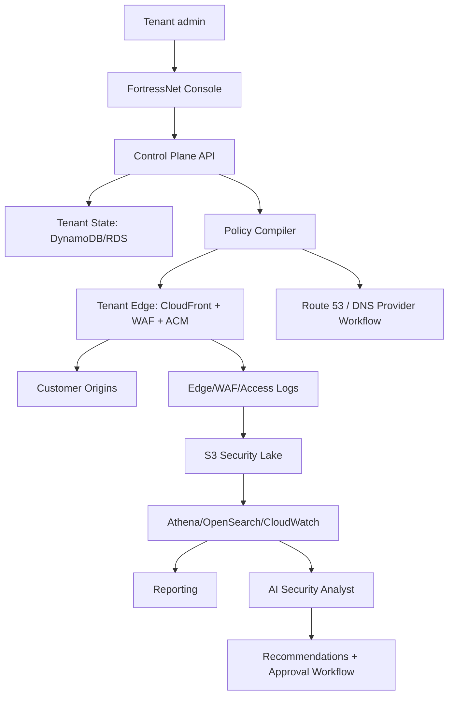

# Plan de Accion: FortressNet SaaS Edge Security

Este documento convierte el analisis comparativo contra Cloudflare WAF, DDoS Protection, SSL/TLS, API Shield, Client-side Security, DNS, DMARC Management y Load Balancing en un plan de ejecucion para FortressNet.

El objetivo no es copiar Cloudflare funcionalidad por funcionalidad. El objetivo es construir una alternativa SaaS multitenant sobre AWS con seguridad operacional real, configuracion guiada por cliente, trazabilidad completa y controles que puedan crecer hacia SASE/ZTNA.

## Estado Actual

FortressNet ya tiene una base productiva:

- Control plane SaaS en ECS Fargate.
- Entrada publica por CloudFront.
- Origin ALB restringido a CloudFront con header privado.
- AWS WAF asociado al edge de la consola.
- Cognito provisionado para identidad base.
- API de gestion protegida por bootstrap token o API key.
- RBAC, users, API keys, perfil personal e IdP metadata persistidos.
- DynamoDB para tenants, dominios, politicas, usuarios, API keys, IdP connections y perfiles.
- RDS privado, S3 para logs/reportes, KMS, CloudWatch, SNS y VPC endpoints.
- Terraform desplegado en `us-east-1`.

Brecha principal: varias capacidades existen como infraestructura o metadata, pero todavia no estan convertidas en producto configurable por tenant ni en enforcement automatico sobre dominios de clientes.

Actualizacion de implementacion: el onboarding ya exige un TXT de propiedad y, solo despues de validarlo, solicita un certificado ACM etiquetado en `us-east-1`. El control plane guarda y muestra los CNAME de validacion de ACM. La creacion de CloudFront/WAF por tenant sigue pendiente de un flujo de aprobacion, health checks y cutover DNS; el sistema no entrega un CNAME de trafico hasta que ese borde exista.

## Principios De Ejecucion

- Seguridad primero: ningun cambio de enforcement automatico sin auditoria y rollback.
- Sin mock data: los dashboards deben mostrar estado vacio, datos reales o instrucciones de activacion.
- Multitenant desde el diseno: todo recurso logico debe incluir `tenant_id`.
- IaC primero: infraestructura base y recursos repetibles deben vivir en Terraform.
- Control plane como fuente de verdad: el estado deseado se guarda en tablas y se compila a AWS.
- AI read-only al inicio: la IA recomienda y explica, pero no bloquea trafico en MVP.
- Configuracion guiada: cada modulo debe tener wizard, validacion, estado y criterios de go-live.

## Arquitectura Objetivo

## Fase 1: Web Edge MVP Real

Objetivo: que un cliente pueda proteger un sitio o API publica end to end sin intervencion manual de infraestructura.

### Epica 1. Domain Onboarding

Entregables:

- Tabla `zones` o extension de `domains` con ownership, mode, apex, subdomains, DNS status y certificate status.
- Wizard: add domain, verify ownership, configure origin, issue certificate, activate edge.
- Verificacion TXT/CNAME automatica.
- Estado visible: `pending_verification`, `verified`, `certificate_pending`, `edge_ready`, `active`, `failed`.
- Validacion de origin antes de activar trafico.

AWS:

- Route 53 para `fortressnet.app` y, cuando aplique, zonas gestionadas.
- ACM `us-east-1` para certificados de CloudFront.
- CloudFront distribution o tenant edge stack por dominio.
- AWS WAFv2 Web ACL por tenant o por grupo de tenants segun escala.

Criterios de aceptacion:

- Un dominio nuevo queda registrado sin datos ficticios.
- El sistema muestra exactamente que registro DNS debe crear el cliente.
- El certificado se emite solo despues de validar ownership.
- El edge no se marca `active` hasta que health check y DNS esten correctos.

### Epica 2. Origin Management

Entregables:

- Modelo `origins`: hostname/IP, protocolo, puerto, host header, SNI, health path, timeout.
- Modelo `origin_pools`: uno o mas origins por dominio.
- Health checks activos y estado historico.
- Soporte para failover basico.

AWS:

- CloudFront origins y origin groups.
- CloudWatch metrics.
- EventBridge para cambios de health.

Criterios de aceptacion:

- El cliente puede cambiar origin sin editar Terraform manual.
- Un origin caido queda reflejado en UI y eventos.
- El failover no se activa sin pool alternativo validado.

### Epica 3. WAF Policy Compiler

Entregables:

- DSL interna de politicas FortressNet.
- Compilador `policy -> AWS WAFv2 rules`.
- Modos `monitor`, `block`, `emergency_lockdown`.
- Managed rules base: Common, Known Bad Inputs, SQLi, IP reputation, anonymous IP cuando aplique.
- Rate limiting por tenant, dominio, path, metodo, IP, pais, ASN y header.
- Allow/block lists por tenant.
- Versionado de politicas y rollback.
- Auditoria de cambios.

AWS:

- AWS WAFv2 Web ACL.
- Rule groups por tenant o compartidos con labels.
- WAF logging hacia S3.

Criterios de aceptacion:

- Crear una politica en UI produce un cambio real en WAF.
- Toda politica tiene diff, version, actor y rollback.
- El modo `monitor` registra eventos sin bloquear.
- El modo `block` se puede activar solo con confirmacion.

### Epica 4. Security Events Reales

Entregables:

- Ingesta de logs CloudFront/WAF desde S3.
- Normalizacion a eventos por tenant, domain, request, rule, action, country, ASN, IP hash.
- Vista de eventos con filtros y drill-down.
- Top blocked paths, top source countries, top rules, top offending IPs.
- Export CSV/JSON.

AWS:

- S3 log buckets.
- Glue catalog.
- Athena para queries iniciales.
- OpenSearch opcional en fase posterior si Athena no alcanza.

Criterios de aceptacion:

- El dashboard no usa valores simulados.
- Los contadores salen de logs reales o muestran estado vacio.
- Cada evento puede rastrearse hasta fuente y timestamp.

## Fase 2: API Shield MVP

Objetivo: proteger APIs con modelo positivo, inventario y validacion.

### Epica 5. API Inventory

Entregables:

- Descubrimiento de endpoints desde logs.
- Agrupacion por metodo, path template, status, auth header y volumen.
- Clasificacion: public, authenticated, sensitive, unknown.
- Vista de API surface por tenant.

Criterios de aceptacion:

- FortressNet descubre endpoints reales despues de recibir trafico.
- Endpoints nuevos aparecen como `unknown` hasta ser clasificados.
- El cliente puede aprobar, ocultar o marcar endpoints sensibles.

### Epica 6. OpenAPI Import And Schema Validation

Entregables:

- Import OpenAPI 3.x.
- Versionado de schemas.
- Validacion de path, metodo, query, headers y body.
- Modo `report-only` antes de bloquear.
- Bloqueo por schema violation.

AWS:

- WAF custom rules cuando el caso sea simple.
- Lambda@Edge o CloudFront Functions solo para validaciones livianas.
- API Gateway opcional para dominios/API dedicadas con validacion avanzada.

Criterios de aceptacion:

- Un schema importado queda asociado a dominio/API.
- Violaciones se registran en `report-only`.
- Enforcement se activa con version de schema aprobada.

### Epica 7. JWT, mTLS y API Auth Posture

Entregables:

- Configuracion JWKS por tenant: issuer, audience, algorithms.
- Validacion JWT en endpoints protegidos.
- Reporte de endpoints sin auth o con auth debil.
- mTLS para APIs enterprise.

AWS:

- API Gateway para mTLS/JWT cuando sea necesario.
- ALB listener rules o CloudFront origin routing segun patron.
- Secrets Manager para metadata sensible.

Criterios de aceptacion:

- Requests con JWT invalido se bloquean en modo enforce.
- Endpoints sensibles sin auth quedan marcados como riesgo.
- mTLS puede habilitarse sin exponer claves privadas en la app.

### Epica 8. Abuse, BOLA y Sequence Analytics

Entregables:

- Deteccion de abuso volumetrico por endpoint.
- Deteccion BOLA inicial por cambios anormales de object id por actor/session.
- Sequence analytics para flujos criticos.
- Recomendaciones de rate limits y reglas.

Criterios de aceptacion:

- El sistema identifica endpoints con comportamiento anomalo.
- La IA explica la razon y propone mitigacion.
- Ninguna mitigacion se aplica automaticamente sin aprobacion.

## Fase 3: DNS, TLS y DMARC Gestionados

Objetivo: que el cliente gestione postura DNS/TLS/email desde FortressNet.

### Epica 9. DNS Management

Entregables:

- Modelo `dns_zones` y `dns_records`.
- Modos Full DNS, Partial/CNAME y External DNS guided.
- CRUD de A, AAAA, CNAME, TXT, MX, CAA, SRV.
- Import/export BIND o CSV.
- Validacion de registros requeridos.
- Deteccion de origin IP expuesta.
- DNSSEC status.

AWS:

- Route 53 Hosted Zones para zonas gestionadas.
- Route 53 APIs para records y DNSSEC donde aplique.

Criterios de aceptacion:

- El cliente puede seguir usando DNS externo con instrucciones claras.
- Si FortressNet gestiona la zona, los cambios quedan auditados.
- DNSSEC y CAA se reportan como postura de seguridad.

### Epica 10. TLS Posture

Entregables:

- Certificados ACM por dominio.
- Renovacion y expiracion visible.
- TLS min version por dominio.
- HSTS, includeSubDomains, preload readiness.
- Reporte de mixed content y redirect loops cuando se detecte.

Criterios de aceptacion:

- Ningun dominio pasa a `active` sin certificado valido.
- El cliente ve acciones concretas para corregir errores TLS.
- Se alerta antes de expiraciones o fallas de renovacion.

### Epica 11. DMARC Management

Entregables:

- Analizador SPF, DKIM, DMARC.
- Generador de politica DMARC progresiva: `none`, `quarantine`, `reject`.
- Ingesta de reportes agregados DMARC.
- Clasificacion de senders autorizados/no autorizados.
- Alertas de spoofing y phishing risk.

AWS:

- SES inbound o mailbox dedicada para reportes DMARC.
- S3 para almacenamiento.
- Athena para analisis.

Criterios de aceptacion:

- Un dominio muestra postura email real.
- Reportes DMARC se procesan por tenant.
- El sistema recomienda cambios sin romper fuentes legitimas.

## Fase 4: Client-Side Security

Objetivo: detectar riesgos del navegador del usuario final.

### Epica 12. Browser Resource Monitoring

Entregables:

- Snippet JavaScript por tenant/dominio.
- Inventario de scripts, conexiones y cookies.
- Fingerprint/hash de scripts externos.
- Deteccion de nuevos dominios externos.
- Alertas por script nuevo, script modificado, cookie insegura o conexion maliciosa.

AWS:

- CloudFront endpoint para collector.
- Kinesis Firehose o API Gateway + Lambda para ingesta.
- S3/Athena para analisis inicial.

Criterios de aceptacion:

- El cliente instala un snippet unico por dominio.
- Recursos aparecen solo despues de visitas reales.
- Se puede generar CSP en `report-only`.

### Epica 13. Content Security Rules

Entregables:

- Generador CSP.
- Modo `report-only`.
- Allowlist por categoria: scripts, styles, images, frames, connect.
- Promocion a enforce con aprobacion.

Criterios de aceptacion:

- CSP report-only no bloquea produccion.
- Los cambios son versionados.
- El cliente puede volver a la version anterior.

## Fase 5: Load Balancing Avanzado

Objetivo: ofrecer balanceo gestionado por cliente.

### Epica 14. Pools, Monitors y Failover

Entregables:

- Pools por dominio/API.
- Health checks por path, status code, response text y timeout.
- Failover automatico.
- Session affinity por cookie.
- Weighted routing.

AWS:

- CloudFront origin groups.
- Route 53 health checks cuando el modo DNS lo requiera.
- ALB/NLB para edge dedicado enterprise.

Criterios de aceptacion:

- Un origin unhealthy deja de recibir trafico si hay alternativo sano.
- El cliente ve historial de health.
- Failover genera evento y alerta.

### Epica 15. Intelligent Routing

Entregables:

- Steering por prioridad.
- Steering por peso.
- Steering geografico inicial.
- Latency-aware routing futuro.

Criterios de aceptacion:

- Cada decision de routing queda explicada.
- La politica activa se puede auditar y revertir.

## Fase 6: DDoS Adaptativo Sin Shield Advanced

Objetivo: maximizar proteccion L7 sin usar Shield Advanced por ahora.

Entregables:

- Baseline de trafico por dominio.
- Deteccion de spikes por RPS, errores, pais, ASN, path y user agent.
- Mitigaciones temporales: rate limit agresivo, block list temporal, geo block temporal, lockdown path.
- Modo under attack por tenant.
- Runbook de mitigacion.

AWS:

- CloudWatch metrics.
- WAF rate-based rules.
- EventBridge.
- Lambda para aplicar cambios controlados.
- SNS para alertas.

Criterios de aceptacion:

- El sistema detecta un spike real o simulado controladamente.
- Mitigacion temporal tiene expiracion.
- Todo cambio queda auditado.

## Fase 7: AI Security Analyst

Objetivo: convertir eventos en explicaciones, reportes y recomendaciones accionables.

Entregables:

- Pipeline de eventos normalizados.
- Resumen diario/semanal por tenant.
- Deteccion de anomalias.
- Explicacion de incidentes.
- Recomendaciones de politicas.
- Workflow de aprobacion antes de enforcement.

AWS:

- S3 event lake.
- Athena/OpenSearch segun volumen.
- Bedrock u OpenAI API segun decision de producto.
- Secrets Manager para credenciales.

Criterios de aceptacion:

- La IA no accede a secretos.
- La IA no modifica politicas directamente.
- Cada recomendacion incluye evidencia, impacto y rollback.

## Fase 8: SASE/ZTNA Continuidad

Objetivo: integrar edge web con acceso privado y seguridad de red.

Entregables:

- Device registry.
- Enrollment tokens.
- FortressNet Agent CLI/daemon.
- Device posture.
- Private apps.
- IdP externo real con OIDC/SAML.
- Politicas por user, group, device, posture y network.
- DNS filtering y SWG basico.

AWS:

- Verified Access para ZTNA.
- Route 53 Resolver DNS Firewall.
- Network Firewall.
- Transit Gateway o Cloud WAN.
- PrivateLink cuando aplique.

Criterios de aceptacion:

- Un usuario accede a una app privada sin VPN tradicional.
- Acceso depende de identidad, grupo y postura.
- Todo acceso queda auditado por tenant.

## Cambios Necesarios En El Control Plane

Nuevas entidades:

- `zones`
- `dns_records`
- `origins`
- `origin_pools`
- `health_checks`
- `certificates`
- `waf_policy_versions`
- `waf_change_sets`
- `api_specs`
- `api_endpoints`
- `api_schema_violations`
- `client_side_resources`
- `dmarc_reports`
- `ai_recommendations`
- `approval_requests`

Nuevas pantallas:

- Domain onboarding wizard.
- DNS.
- Origins.
- WAF policies.
- WAF events.
- API inventory.
- API schemas.
- TLS posture.
- DMARC.
- Client-side security.
- Load balancing.
- AI analyst.
- Approvals.

Nuevos servicios internos:

- `policy-compiler`
- `edge-provisioner`
- `dns-verifier`
- `certificate-manager`
- `log-normalizer`
- `api-discovery-worker`
- `client-side-collector`
- `ai-analyst-worker`
- `approval-engine`

## Orden Recomendado De Implementacion

1. Crear modelos Terraform/DynamoDB faltantes para dominios, origins, pools, certs, policy versions y change sets.
2. Implementar Domain Onboarding Wizard.
3. Implementar DNS verifier y certificate manager.
4. Implementar tenant edge provisioning controlado.
5. Implementar WAF policy compiler con modo monitor.
6. Activar WAF logging por tenant y eventos reales.
7. Implementar rate limiting y allow/block lists.
8. Implementar origin health y failover.
9. Implementar API inventory desde logs.
10. Implementar OpenAPI import y schema validation en report-only.
11. Implementar JWT validation.
12. Implementar reporting y AI Analyst read-only.
13. Implementar DMARC posture.
14. Implementar client-side snippet y CSP report-only.
15. Implementar DDoS adaptive mode.
16. Implementar SASE/ZTNA device registry y private apps.

## Definition Of Done Global

Una capacidad se considera lista solo si cumple:

- UI/API funcional por tenant.
- Modelo de datos con `tenant_id`.
- Terraform o provisioner controlado.
- Auditoria con actor, timestamp, before/after y request id.
- Logs reales o estado vacio, sin mock data.
- Tests de validacion de API.
- Verificacion post-deploy.
- Rollback documentado.
- Permisos IAM de minimo privilegio.
- Sin secretos en logs, frontend, commits o outputs.

## Riesgos Y Decisiones Pendientes

- CloudFront por tenant vs Web ACL compartida: balancear aislamiento, limites y costo.
- API Gateway para API Shield avanzado: mejora validacion, pero cambia el modelo de edge para APIs.
- OpenSearch vs Athena: Athena es menor costo inicial, OpenSearch mejora investigacion interactiva.
- IdP externo: hoy se guarda metadata; falta federacion real con Cognito o broker OIDC/SAML propio.
- Shield Advanced: se mantiene fuera de base por decision actual, pero debe quedar como add-on enterprise.
- BYOC y Keyless SSL: no son MVP, pero deben contemplarse para clientes regulados.

## Hitos De Entrega

| Hito | Resultado | Validacion |
| --- | --- | --- |
| M1 | Dominio activable end to end | Dominio real pasa por FortressNet con TLS y origin health |
| M2 | WAF compiler | Politica UI genera reglas WAF reales con rollback |
| M3 | Eventos reales | Dashboard alimentado por logs reales |
| M4 | API inventory | Endpoints detectados desde trafico real |
| M5 | API schema report-only | Violaciones OpenAPI visibles sin bloquear |
| M6 | TLS/DNS posture | Dominio muestra DNSSEC/CAA/TLS/expiry |
| M7 | AI Analyst | Reporte con evidencia y recomendaciones |
| M8 | Client-side security | Snippet detecta scripts/cookies/conexiones |
| M9 | Load balancing | Pool con health check y failover |
| M10 | ZTNA/SASE foundation | Device registry y private app MVP |
