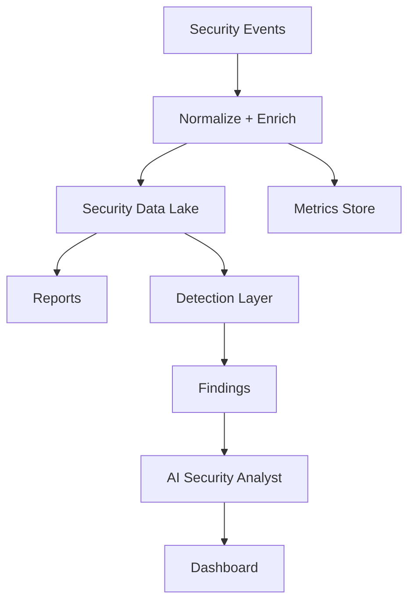

# Metricas, Trazabilidad, Reporting e IA

Esta capa es central para FortressNet. El producto debe explicar que paso, por que paso y que deberia hacerse despues.

## Pipeline



## Metricas clave

Dimensiones:

- `tenant_id`
- `domain`
- `application`
- `endpoint`
- `rule_id`
- `country`
- `asn`
- `client_ip`
- `user_agent`
- `request_id`

Metricas:

- Requests totales.
- Requests permitidas.
- Requests bloqueadas.
- Challenges enviados.
- Rate limits activados.
- WAF matches.
- Bot score promedio.
- Top endpoints atacados.
- Top IPs, ASNs y paises.
- Latencia p95/p99 agregada por FortressNet.
- Errores 4xx/5xx.
- Bandwidth por tenant.
- Coste estimado por tenant.
- Falsos positivos reportados.
- Reglas con mayor impacto.

## Trazabilidad

Cada request relevante debe tener `request_id`.

```json
{
  "request_id": "req_01HX",
  "tenant_id": "tenant_acme",
  "domain": "api.acme.com",
  "path": "/login",
  "client_ip": "203.0.113.10",
  "country": "ES",
  "bot_score": 82,
  "waf_result": "matched",
  "policy_result": "blocked",
  "final_action": "block",
  "rule_id": "login_bruteforce_001",
  "latency_ms": 14
}
```

Preguntas que debe responder:

- Por que se bloqueo esta request.
- Que regla se activo.
- Que capa tomo la decision.
- Cuanto tiempo agrego la inspeccion.
- Si el evento forma parte de una campana.

## Reporting

### Operational Report

Para SRE/DevOps:

- Trafico.
- Latencia.
- Disponibilidad.
- Errores.
- Health de origins.
- Consumo.

### Security Report

Para SecOps:

- Ataques bloqueados.
- Severidad.
- Reglas activadas.
- Actividad de bots.
- Campanas detectadas.
- IPs recurrentes.
- Recomendaciones.

### Executive Report

Para direccion:

- Riesgo reducido.
- Incidentes prevenidos.
- Tendencias.
- SLA.
- Coste.
- Cumplimiento.

## AI Security Analyst

El analizador IA no debe bloquear trafico critico directamente en el MVP. Su rol inicial es:

- Resumir incidentes.
- Correlacionar eventos.
- Detectar patrones.
- Sugerir reglas.
- Explicar decisiones.
- Generar reportes.
- Identificar posibles falsos positivos.

Entrada:

- Eventos WAF.
- Rate limits.
- Bot scoring.
- Cambios de configuracion.
- Deployments.
- Logs del origin.
- Historico del tenant.
- Politicas activas.

Salida:

```json
{
  "finding_id": "finding_123",
  "tenant_id": "tenant_acme",
  "severity": "high",
  "confidence": 0.91,
  "title": "Credential stuffing against /login",
  "summary": "18,420 failed login attempts in 12 minutes from hosting ASNs.",
  "recommended_actions": [
    "Reduce anonymous /login rate limit to 5/min",
    "Challenge bot_score > 70",
    "Temporarily block high-risk ASN group"
  ]
}
```

## Regla de seguridad

Motores deterministicos bloquean. IA explica y recomienda.

Acciones automaticas aceptables:

- Crear finding.
- Crear reporte.
- Agrupar eventos.
- Etiquetar campana.
- Enriquecer IP/ASN.
- Proponer cambio de policy.

Acciones que requieren aprobacion:

- Cambiar reglas de bloqueo.
- Bloquear ASNs completos.
- Cambiar rate limits de produccion.
- Modificar politicas ZTNA.

