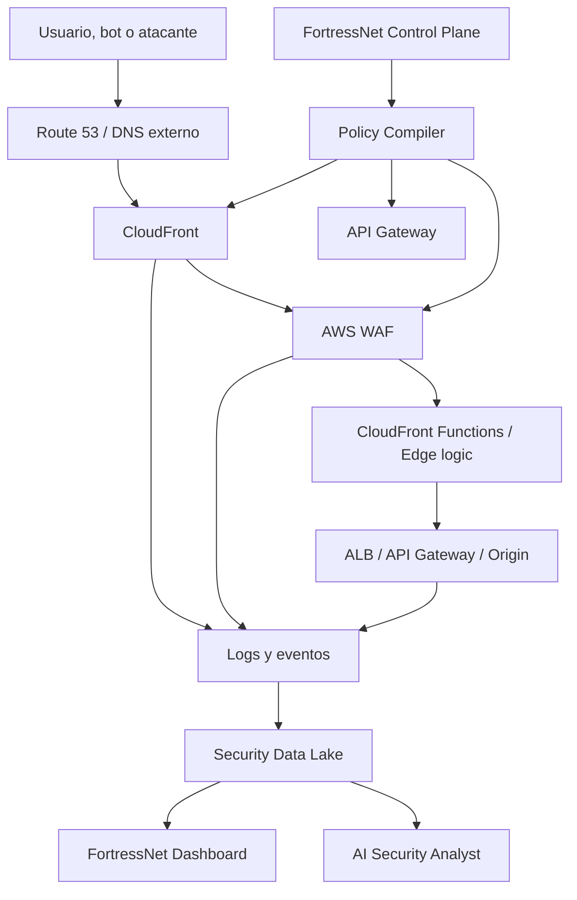

# Arquitectura General

FortressNet se compone de dos planos:

- **Data plane**: procesa trafico, aplica protecciones y genera eventos.
- **Control plane**: gestiona tenants, dominios, policies, despliegues AWS, usuarios, billing y reporting.

## Componentes principales

### Control Plane

Responsable de:

- Crear y administrar tenants.
- Gestionar usuarios, roles y SSO.
- Registrar dominios y validar ownership.
- Definir origins y aplicaciones.
- Crear policies de seguridad.
- Compilar policies hacia servicios AWS.
- Mostrar metricas, eventos, findings y reportes.
- Gestionar billing y planes.

### Data Plane

Responsable de:

- Recibir trafico HTTP/HTTPS.
- Aplicar CDN, routing y TLS.
- Ejecutar WAF, rate limiting y reglas edge.
- Enviar trafico permitido al origin.
- Bloquear, desafiar o limitar trafico sospechoso.
- Generar eventos trazables por request.

### Security Analytics Plane

Responsable de:

- Ingestar logs de CloudFront, WAF, API Gateway, ALB y Decision Engine.
- Normalizar eventos por tenant.
- Calcular metricas agregadas.
- Detectar anomalias.
- Generar findings.
- Producir reportes ejecutivos y tecnicos.
- Alimentar el AI Security Analyst.

## Principio de diseño

FortressNet no debe ser solo una coleccion de servicios AWS. El valor diferencial esta en:

- Politicas declarativas y versionables.
- Explicabilidad de decisiones.
- Trazabilidad por request.
- Multi-tenancy gestionado.
- Reporting de seguridad orientado al cliente.
- Analisis IA sobre eventos y comportamiento.

