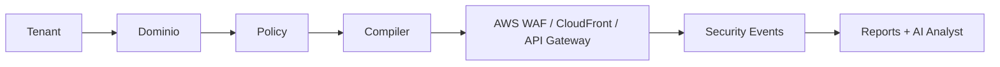

# Fases del Producto

## Fase 0: PoC Tecnico

Objetivo: validar el flujo minimo de proteccion.

Incluye:

- Un dominio de prueba.
- CloudFront delante de un origin simple.
- AWS WAF con reglas basicas.
- Logs a S3.
- Consultas manuales con Athena.

No incluye:

- Billing.
- Multi-tenancy completo.
- ZTNA.
- SASE.
- IA continua.

## Fase 1: Edge Security MVP

Objetivo: primer producto util para proteger aplicaciones publicas y APIs.

Incluye:

- Control plane multi-tenant basico.
- Onboarding de dominios.
- Validacion DNS.
- Provisioning de CloudFront, ACM y AWS WAF.
- Reglas WAF y rate limiting.
- Policy compiler inicial.
- Logs normalizados.
- Dashboard de seguridad.
- Reporting semanal/mensual.
- AI Security Analyst en modo read-only.

El backlog operativo detallado para llevar esta fase y sus extensiones a
paridad funcional progresiva esta en
[`cloudflare-parity-action-plan.md`](cloudflare-parity-action-plan.md).

## Fase 2: ZTNA MVP

Objetivo: acceso privado sin VPN para aplicaciones internas.

Incluye:

- AWS Verified Access.
- Integracion con IdP por tenant.
- Politicas por usuario, grupo, contexto y postura.
- Auditoria de accesos.
- Reporting de acceso Zero Trust.

## Fase 3: SASE Basico

Objetivo: extender FortressNet hacia seguridad de red y conectividad enterprise.

Incluye:

- AWS Cloud WAN o Transit Gateway.
- AWS Network Firewall.
- Route 53 Resolver DNS Firewall.
- Security VPC.
- Segmentacion de red.
- Egress control.
- Integracion con sedes, VPCs y workloads.

## Fase 4: Enterprise

Objetivo: clientes regulados o de alto volumen.

Incluye:

- Cuenta AWS dedicada por tenant.
- KMS dedicado.
- Logs dedicados.
- Retencion custom.
- SSO/SAML obligatorio.
- SLAs.
- Integracion SIEM.
- Marketplace AWS.
