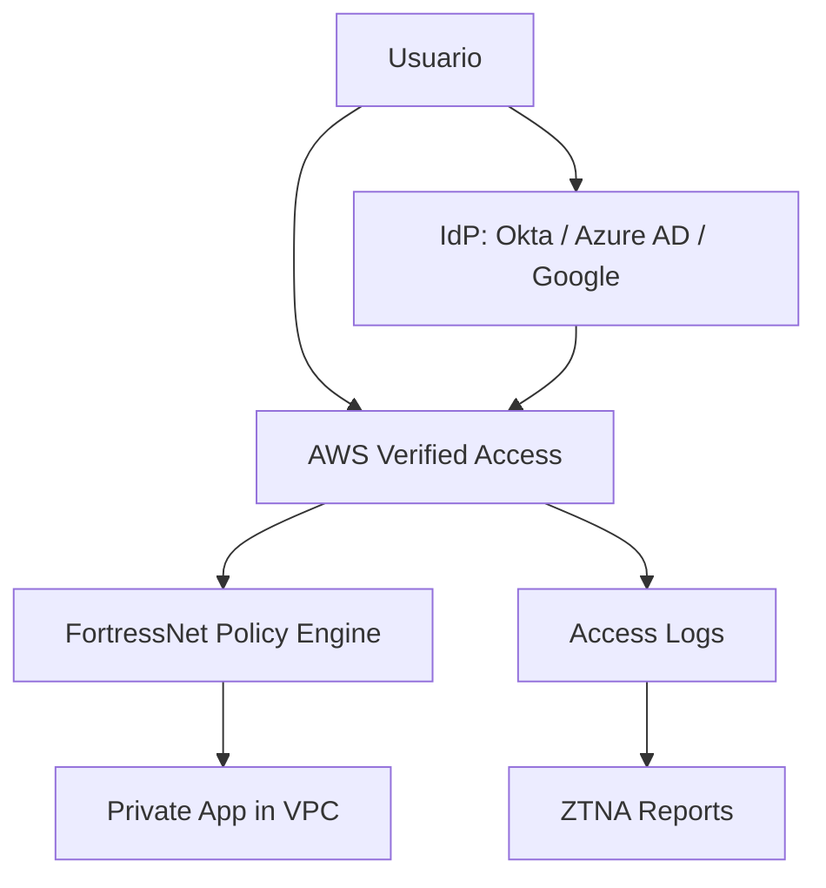
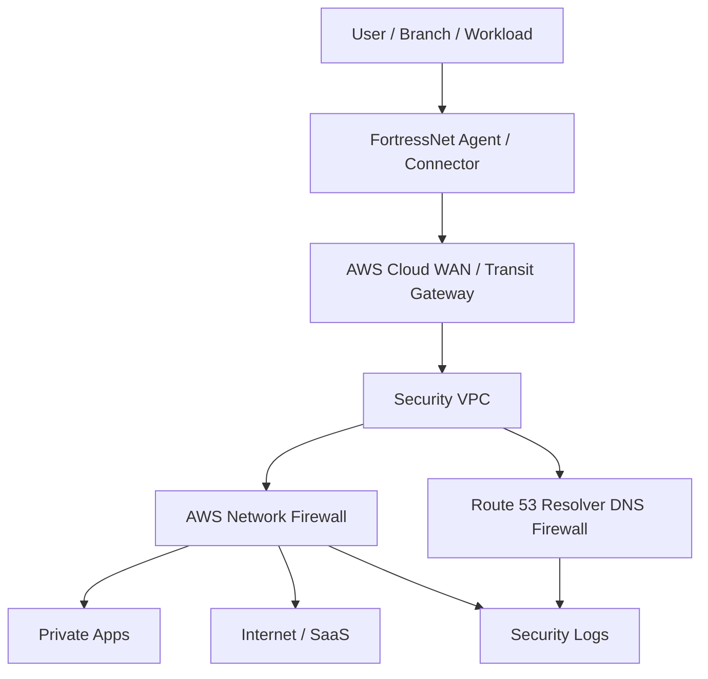

# SASE y ZTNA

SASE y ZTNA son extensiones naturales de FortressNet, pero no pertenecen al primer MVP de edge security.

## Definiciones

- **ZTNA**: acceso Zero Trust a aplicaciones privadas sin exponerlas directamente ni depender de VPN tradicional.
- **SASE**: plataforma que combina networking y seguridad: ZTNA, SWG, CASB, FWaaS, DNS security, DLP, segmentacion y observabilidad.

## Producto

```text
FortressNet Shield
  Apps publicas, APIs, WAF, bot protection, reporting

FortressNet Access
  ZTNA, acceso privado, SSO, posture, auditoria

FortressNet SASE
  Red global, inspeccion, DNS security, egress control, segmentacion
```

## ZTNA con AWS Verified Access



FortressNet aporta:

- Portal por tenant.
- Politicas como codigo.
- Mapeo de grupos a permisos.
- Auditoria de accesos.
- Trazabilidad por usuario y app.
- Recomendaciones IA.

## SASE basico



Funciones:

- Segmentacion de red.
- Control de egress.
- DNS filtering.
- Inspeccion L3-L7.
- Integracion con VPCs y sedes.
- Reporting de red.

## Orden recomendado

1. Edge Security MVP.
2. ZTNA para 1 app privada.
3. ZTNA multi-app por tenant.
4. SASE basico con Security VPC.
5. SASE enterprise multi-region.

No activar SASE completo hasta tener cliente enterprise que pague el coste operativo.

