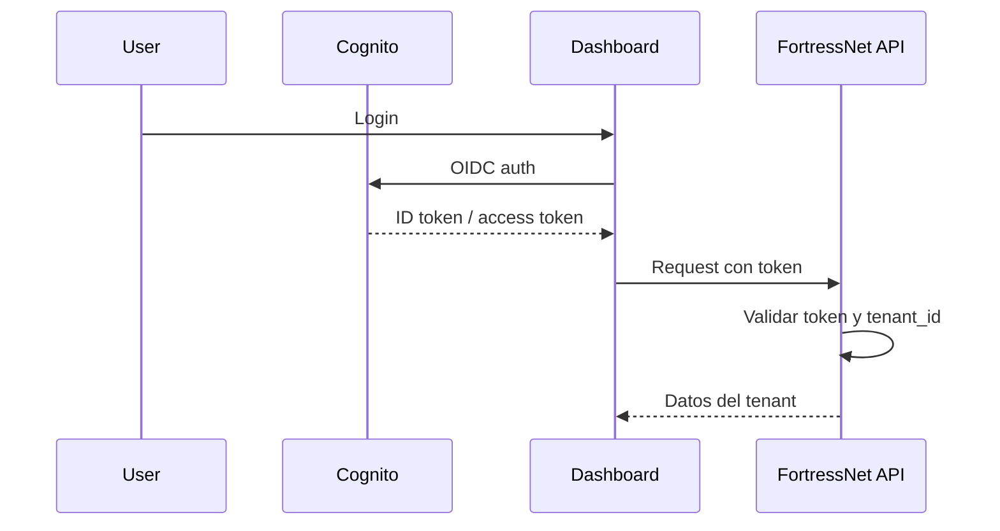
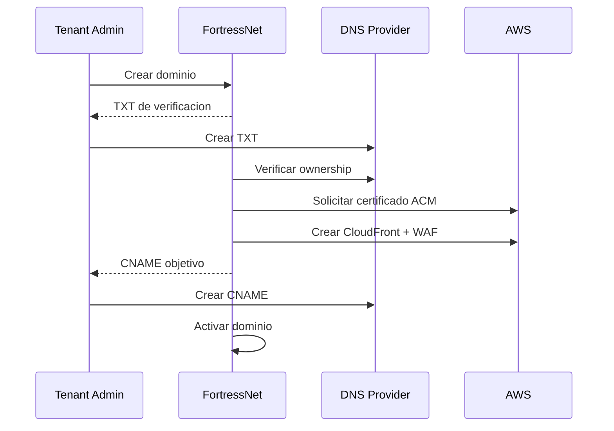

# Tenancy, Autenticacion y DNS

## Modelo multi-tenant

El MVP usa aislamiento logico:

- Una plataforma compartida.
- Base de datos compartida.
- Todas las entidades con `tenant_id`.
- Row Level Security en PostgreSQL.
- Logs particionados por tenant.
- Recursos AWS etiquetados por tenant.

Clientes enterprise podran usar aislamiento dedicado:

- Cuenta AWS separada.
- KMS dedicado.
- Buckets dedicados.
- Web ACLs y distribuciones dedicadas.
- Politicas de retencion especificas.

## Entidades base

```text
tenant
  id
  name
  plan
  region
  isolation_mode
  status

user
  id
  tenant_id
  email
  role
  identity_provider

domain
  id
  tenant_id
  hostname
  verification_status
  tls_status
  cloudfront_distribution_id

application
  id
  tenant_id
  domain_id
  origin_url
  status

policy
  id
  tenant_id
  application_id
  version
  status
  document
```

## Autenticacion del dashboard

El dashboard usa Cognito con Authorization Code + PKCE. La API valida el ID token firmado contra el user pool y cruza el sujeto con el registro de usuario y los grupos Cognito antes de resolver el tenant y los scopes. Los atributos mutables del token no autorizan acceso por si solos.

Los origenes OAuth de produccion son `https://fortressnet.app` y `https://app.fortressnet.app`; cada uno tiene registrados sus callbacks `/auth/callback` y logout `/logout`. No se aceptan hosts del ALB, IPs o callbacks locales. El access token solicita el scope `aws.cognito.signin.user.admin` exclusivamente para las operaciones TOTP token-autorizadas de Cognito.



Claims esperados:

```json
{
  "sub": "user_123",
  "email": "secops@example.com",
  "cognito:groups": ["security_admins"]
}
```

Roles iniciales:

- `platform_owner`
- `tenant_admin`
- `security_admin`
- `security_analyst`
- `billing_admin`
- `read_only`

`platform_owner` es un rol global de FortressNet: puede ver todos los tenants, operar la configuracion transversal, crear tenants y administrar planes. No puede aprobar cambios que afecten a un tenant cliente. Las aprobaciones de edge, WAF, cambios de origen y Verified Access requieren un `tenant_admin` o `security_admin` activo, perteneciente al mismo `tenant_id` y distinto del solicitante. Un administrador de tenant solo recibe datos y puede operar recursos de su propio tenant.

## Alta de cliente y baseline WAF

El alta se inicia desde el asistente modal de cuenta cliente. La operacion crea primero la cuenta, envia la invitacion Cognito al administrador inicial y despues registra el tenant, su entitlement y la baseline de AWS WAF. Una cuenta puede tener varios tenants; la membresia del usuario conserva los `tenant_ids` autorizados y cada solicitud se valida contra el tenant del recurso.

La ruta heredada de alta directa de tenant queda deshabilitada: toda integracion debe usar el flujo `customer-onboarding` para que no existan tenants sin cuenta cliente, administrador ni baseline de seguridad.

Cada tenant recibe una baseline en modo `monitor` con `AWSManagedRulesCommonRuleSet`, `AWSManagedRulesKnownBadInputsRuleSet`, `AWSManagedRulesSQLiRuleSet`, reputacion IP, IP anonimas y rate limiting. Al crear un edge, esas reglas se aplican inicialmente con `Count`; cualquier cambio del cliente se realiza mediante change set y aprobacion independiente.

El hostname publico protegido nunca puede ser usado como origen. Antes de marcar el cutover como activo, FortressNet confirma tanto el CNAME como una respuesta correcta a traves del edge. El origen debe tener un hostname HTTPS separado que permanezca apuntando a la aplicacion cuando el hostname publico se redirige a CloudFront.

Las invitaciones se crean desde FortressNet mediante Cognito `AdminCreateUser`; el correo temporal lo entrega Cognito. La cuenta se activa al completar el primer login. El token de bootstrap queda solo como recuperacion controlada de plataforma.

La configuracion TOTP se inicia en el perfil de FortressNet despues del primer login. El backend comprueba que el access token pertenezca al mismo sujeto del ID token y llama a `AssociateSoftwareToken`, `VerifySoftwareToken` y `SetUserMFAPreference`. El QR se genera en el navegador con el emisor `FortressNet`; el secreto no se persiste y los eventos de auditoria registran unicamente el inicio y la confirmacion de la operacion. Cognito Managed Login no ofrece una configuracion de emisor para su QR nativo, por lo que el portal no usa ese QR para el alta con marca FortressNet.

Cuando el registro de usuario tiene `mfa_required = true`, el middleware de scopes bloquea toda operacion de gestion con `mfa_enrollment_required` hasta que el perfil tenga una confirmacion TOTP. Solo las operaciones de perfil necesarias para completar el alta permanecen disponibles. Tras la confirmacion, Cognito marca el software token como MFA preferido y solicita el codigo en los siguientes inicios de sesion.

## SSO por tenant

Para clientes B2B:

- OIDC con Okta, Azure AD o Google Workspace mediante provider Cognito.
- SAML para enterprise mediante URL de metadata.
- El secreto OIDC se envia una unica vez a Cognito y no se persiste en DynamoDB.
- Auto-provisioning opcional y rol por defecto limitado a la conexion del IdP; la conexion, no un claim mutable, determina el tenant.

La autenticacion del dashboard es independiente de la autenticacion de usuarios finales de las aplicaciones protegidas.

## Gestion DNS

### Modo A: CNAME simple

El cliente conserva su DNS:

```text
api.customer.com CNAME tenant123.edge.fortressnet.io
```

Es el modo recomendado para el MVP.

### Modo B: Delegacion de subdominio

El cliente delega un subdominio:

```text
edge.customer.com NS ns-xxx.awsdns.com
```

FortressNet gestiona la hosted zone en Route 53.

### Modo C: DNS completo gestionado

FortressNet gestiona toda la zona DNS del cliente. Esta opcion queda para fases posteriores por el riesgo operativo.

## DNS Gestionado Y Postura

El control plane ofrece dos modos por dominio previamente verificado:

- `external_guided`: FortressNet no modifica DNS externo y entrega instrucciones verificables.
- `route53_delegated`: FortressNet crea una hosted zone publica, devuelve sus NS y solo permite registros dentro del sufijo delegado.

Cada zona, cambio y registro queda asociado a `tenant_id`, cifrado en DynamoDB y auditado. La postura consulta CAA, DMARC, SPF, DNSSEC y compara las direcciones del hostname con el origin para detectar exposicion directa. El soporte apex usa Alias/ANAME del proveedor; no se simula un CNAME apex invalido.

## Flujo de onboarding de dominio


