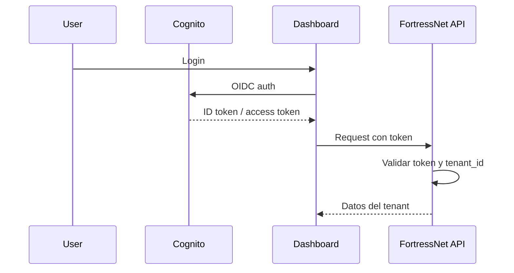
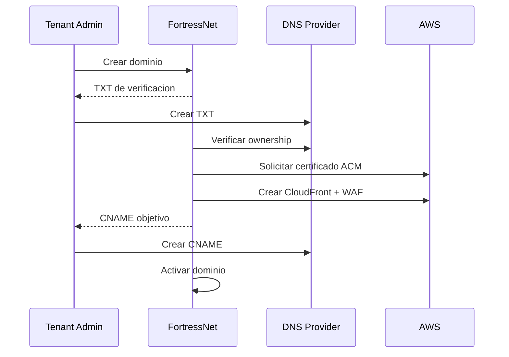

# Tenancy, Autenticacion y DNS

## Modelo multi-tenant

El MVP usa aislamiento logico:

- Una plataforma compartida.
- Base de datos compartida.
- Todas las entidades con `tenant_id`.
- Row Level Security en PostgreSQL.
- Logs particionados por tenant.
- Recursos AWS etiquetados por tenant.

Clientes enterprise podran usar aislamiento dedicado:

- Cuenta AWS separada.
- KMS dedicado.
- Buckets dedicados.
- Web ACLs y distribuciones dedicadas.
- Politicas de retencion especificas.

## Entidades base

```text
tenant
  id
  name
  plan
  region
  isolation_mode
  status

user
  id
  tenant_id
  email
  role
  identity_provider

domain
  id
  tenant_id
  hostname
  verification_status
  tls_status
  cloudfront_distribution_id

application
  id
  tenant_id
  domain_id
  origin_url
  status

policy
  id
  tenant_id
  application_id
  version
  status
  document
```

## Autenticacion del dashboard

El dashboard usa Cognito con Authorization Code + PKCE. La API valida el ID token firmado contra el user pool y cruza el sujeto con el registro de usuario y los grupos Cognito antes de resolver el tenant y los scopes. Los atributos mutables del token no autorizan acceso por si solos.



Claims esperados:

```json
{
  "sub": "user_123",
  "email": "secops@example.com",
  "cognito:groups": ["security_admins"]
}
```

Roles iniciales:

- `platform_owner`
- `tenant_admin`
- `security_admin`
- `security_analyst`
- `billing_admin`
- `read_only`

Las invitaciones se crean desde FortressNet mediante Cognito `AdminCreateUser`; el correo temporal lo entrega Cognito. La cuenta se activa al completar el primer login. El token de bootstrap queda solo como recuperacion controlada de plataforma.

## SSO por tenant

Para clientes B2B:

- OIDC con Okta, Azure AD o Google Workspace mediante provider Cognito.
- SAML para enterprise mediante URL de metadata.
- El secreto OIDC se envia una unica vez a Cognito y no se persiste en DynamoDB.
- Auto-provisioning opcional y rol por defecto limitado a la conexion del IdP; la conexion, no un claim mutable, determina el tenant.

La autenticacion del dashboard es independiente de la autenticacion de usuarios finales de las aplicaciones protegidas.

## Gestion DNS

### Modo A: CNAME simple

El cliente conserva su DNS:

```text
api.customer.com CNAME tenant123.edge.fortressnet.io
```

Es el modo recomendado para el MVP.

### Modo B: Delegacion de subdominio

El cliente delega un subdominio:

```text
edge.customer.com NS ns-xxx.awsdns.com
```

FortressNet gestiona la hosted zone en Route 53.

### Modo C: DNS completo gestionado

FortressNet gestiona toda la zona DNS del cliente. Esta opcion queda para fases posteriores por el riesgo operativo.

## DNS Gestionado Y Postura

El control plane ofrece dos modos por dominio previamente verificado:

- `external_guided`: FortressNet no modifica DNS externo y entrega instrucciones verificables.
- `route53_delegated`: FortressNet crea una hosted zone publica, devuelve sus NS y solo permite registros dentro del sufijo delegado.

Cada zona, cambio y registro queda asociado a `tenant_id`, cifrado en DynamoDB y auditado. La postura consulta CAA, DMARC, SPF, DNSSEC y compara las direcciones del hostname con el origin para detectar exposicion directa. El soporte apex usa Alias/ANAME del proveedor; no se simula un CNAME apex invalido.

## Flujo de onboarding de dominio


